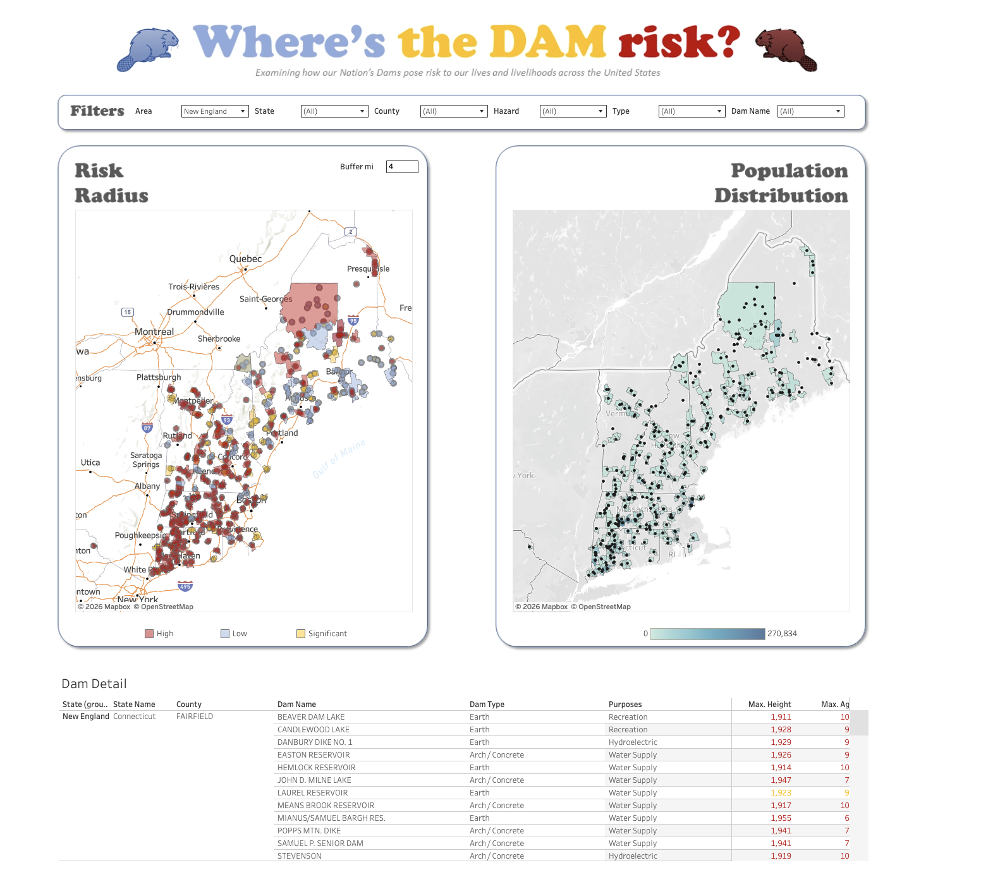
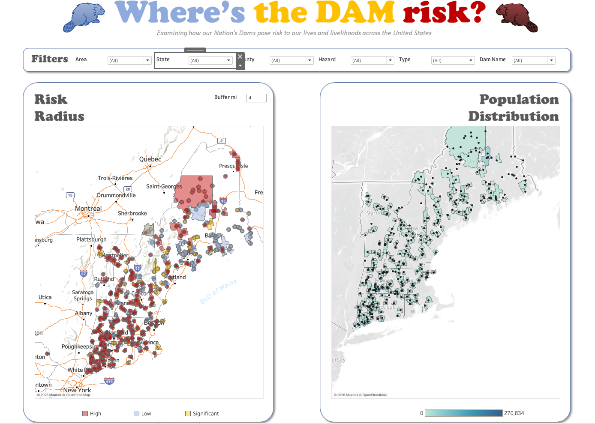
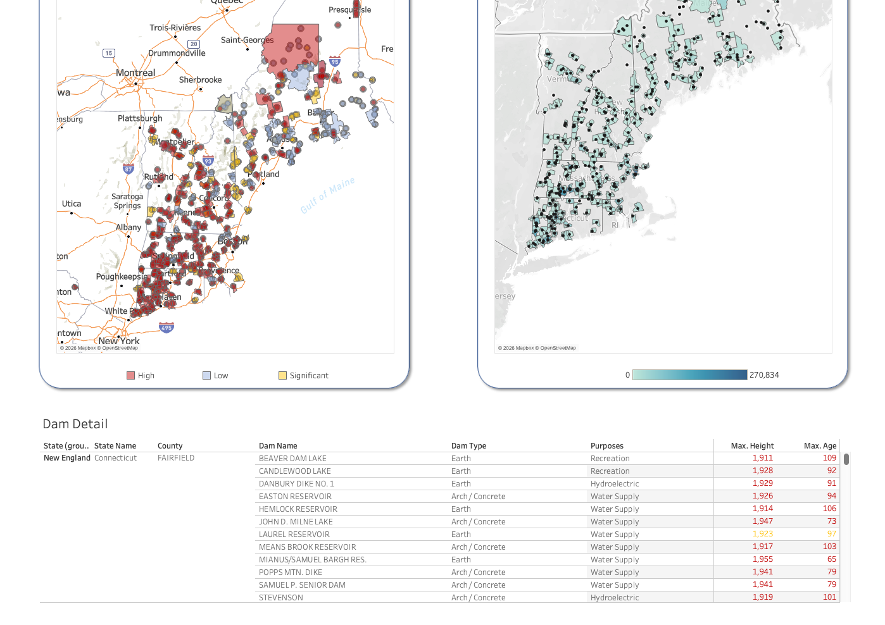

#  Dam Risk Analysis Dashboard using Tableau

## Project Overview

This project presents an interactive Tableau dashboard for analyzing dam risk across the United States. It combines geospatial visualization with infrastructure and population data, enabling users to explore dam locations, hazard classifications, and nearby population exposure through interactive maps and filters.

The dashboard was designed to support exploratory analysis by allowing users to filter data by geographic region, hazard level, dam type, and individual dam.

---

## Business Problem

Dam failures can pose significant risks to communities, infrastructure, and the environment. Understanding these risks requires more than simply mapping dam locations—it also requires analyzing surrounding population exposure and infrastructure characteristics.

This project demonstrates how interactive geospatial analytics can help visualize dam-related risk and support better decision-making.

---

## Objectives

- Visualize dam locations across the United States.
- Identify dams by hazard classification.
- Analyze nearby population distribution.
- Explore dam characteristics such as type, purpose, height, and age.
- Enable interactive filtering for detailed geographic analysis.

---

## Data Source

The dashboard uses a publicly available dataset containing information about dams across the United States, including:

- Dam locations
- Hazard classifications
- Dam types
- Dam purposes
- Maximum height
- Dam age
- Population distribution

---

## Dashboard Features

- Interactive filters for Area, State, County, Hazard Classification, Dam Type, and Dam Name.
- Risk Radius map displaying dam locations and surrounding risk areas.
- Population Distribution map highlighting nearby population exposure.
- Adjustable buffer distance parameter for spatial analysis.
- Detailed table containing dam information including type, purpose, maximum height, and age.
- Interactive dashboard with dynamic filtering and drill-down capabilities.

---

## Dashboard Preview

### Dashboard Overview

### Dashboard (Top)

### Dashboard (Bottom)

---

## Key Insights

- Hazard classifications help identify dams with higher potential risk.
- Population distribution provides context for understanding communities that may be affected.
- Interactive filters enable detailed analysis across different geographic regions.
- Combining geospatial mapping with infrastructure data provides a more comprehensive view of dam-related risk.

---

## Project Approach

The dashboard was developed using Tableau's geospatial capabilities and interactive visualization features by:

- Integrating dam and population datasets.
- Performing spatial analysis to identify nearby population areas.
- Building interactive geospatial maps.
- Creating calculated fields and parameters for dynamic analysis.
- Designing an intuitive dashboard that supports exploratory analysis.

---

## Business Value

This dashboard demonstrates how Tableau can transform infrastructure and geospatial data into meaningful visual insights. By combining maps, interactive filtering, and population analysis, the dashboard provides an effective way to explore dam-related risks and support data-driven decision-making.

---

## Live Dashboard

Explore the interactive dashboard on Tableau Public:

**https://public.tableau.com/app/profile/pankaj.vats8347/viz/DAMProject_17801103055050/DamRisk**

---

- Tableau Public: https://public.tableau.com/app/profile/pankaj.vats8347